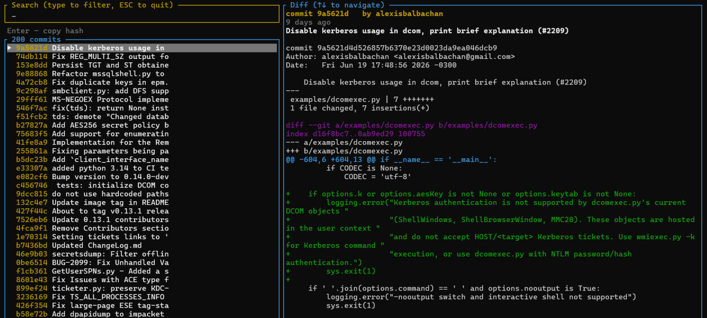

# glit

Interactive git log viewer with fuzzy search and diff preview - right in your terminal.

Built with Rust + [ratatui](https://github.com/ratatui-org/ratatui).

## Demo



## Features

- Fuzzy search through commit history in real time
- Instant diff preview with syntax highlighting
- Copy commit hash to clipboard with one key
- Scroll through long diffs without leaving the TUI
- Keyboard-only navigation
- Fast - loads 200 commits instantly
- Works on Linux, macOS, and WSL

## Installation

```bash
cargo install --git https://github.com/bytewx/glit
```

## Usage

Run inside any git repository:

```bash
glit
```

## Controls

| Key           | Action                        |
|---------------|-------------------------------|
| Type anything | Fuzzy search                  |
| ↑ / ↓         | Navigate commits              |
| PgUp / PgDn   | Scroll diff                   |
| Enter         | Copy commit hash to clipboard |
| ESC           | Quit                          |

## Changelog

### v1.1
- Copy commit hash to clipboard via `Enter`
- Diff scrolling with `PageUp` / `PageDn`
- Status bar with copy confirmation
- Fixed panic on Cyrillic and multibyte Unicode
- Fixed clipboard on WSL

### v1.0
- Initial release
- Fuzzy search through commit history
- Live diff preview with syntax highlighting
- Keyboard navigation

## Built with

- [ratatui](https://github.com/ratatui-org/ratatui) - TUI framework
- [fuzzy-matcher](https://github.com/lotabout/fuzzy-matcher) - Fuzzy search
- [arboard](https://github.com/1Password/arboard) - Clipboard support